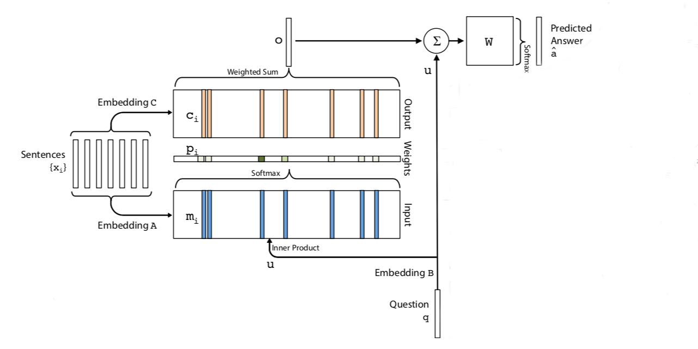

# Understanding End-to-End Memory Networks (MemN2N)

## Introduction to Memory Networks

Before the rise of Transformers, memory networks played a pivotal role in natural language processing tasks, particularly in question-answering and chatbot applications. These models paved the way for sophisticated conversational AI systems. In this post, we will try to understand the underlying concept of the MemN2N model, by exploring its architecture and how it operates.

It is based on Memory Networks to overcome some of their shortcomings, namely:
- use of hard attention
- explicit supervision of attention during training
- limited to simple tasks

MemN2N can be thought of as a 'soft attention' version of the original Memory Networks, requiring supervision only on the final output.

## The MemN2N Architecture

The MemN2N architecture, short for End-to-end Memory Network, was designed to understand and respond to natural language questions based on information stored in its memory. Let's break down its architecture step by step, as outlined in the original paper.

It consists of two main modules:
1. Memory module
2. Controller module

### Memory Module
Inside this, there are memory vectors. Imagine we have a set of input sentences, denoted as {x1, x2, ..., xi}, which we want to store in memory. These sentences are converted into memory vectors {m1, m2, ..., mi}, each of dimension 'd,' using an embedding matrix 'A' of size 'd×V'.
Additionally, this module also embeds the input sequences {x1, x2, ..., xi}, using embedding matrix 'C' giving c_i.

### Controller Module
The controller module contains internal state vectors that also come from input or can be fixed vectors. Essentially, these are the embedding vectors of the question, q from the input. These internal state vectors are used to address the memory, which in turn gives a next vector that can be added to the state vector. 
Here question 'q' is embedded, using embedding matrix 'B' with the same dimensions as 'A,' to create an internal state 'u'. 

## Memory Addressing

The addressing signal from the controller module u, essentially the state vector, is used to take the dot product with the memory vectors {m1, m2, ..., mi}. This will give the similarity score between them. Applying the softmax to it will give the probability distribution over the memory locations, particularly the attention weights resulting in a probability vector 'p'.
Now, we have the relevant vector from the input sequences of the story with respect to the query.

)

The response vector 'o' from memory is a weighted sum of these transformed inputs 'ci,' weighted by the probability vector 'p' obtained from the input.

This weighted sum operation allows the model to focus on relevant information.

## Generating the Final Prediction

In the single-layer case, the output vector 'o' and the input embedding 'u' are combined using a weight matrix 'W' and a softmax function to produce the predicted label 'â'.

))

The overall architecture of the single-layer MemN2N model is depicted in Figure above, with the entire process facilitating smooth gradient computation for backpropagation during training.

The MemN2N model can be extended to handle multiple memory hops or layers. These layers are stacked, and the input to layers above the first is the sum of the output 'o' and the input 'u' from the previous layer. Each layer has its own embedding matrices 'Ak' and 'Ck' for embedding inputs, and different weights.
## Example Scenario

Let's say we have a story-question pair as

**Story:**

1. Sam moved to garden.
2. Sam went to kicthen.
3. Sam drops apple there.

**Question:**

Where is Sam?

In the initial step, we take each sentence from the story and transform it into a memory vector, resulting in three memory vectors {m1, m2, m3}. Similarly, we do the same for the question, creating a controller state vector, 'u.' Following this, we utilize a dot product and softmax operation to determine attention weights.

In a conceptual sense, as the first two sentences contain information about Sam's location, the model assigns higher weights to these sentences during the attention calculation. However, considering the time embedding, the model may prioritize the more recent information. In this case, it assigns a higher attention score to the second sentence.

Next, we perform a weighted sum of the memory vectors and incorporate it back into the controller state, as illustrated in the figure below. Finally, we apply a softmax operation to obtain the final answer.

## Applications

To illustrate the MemN2N model in action, consider a chatbot that stores previous user interactions in memory and utilizes this knowledge to respond intelligently to new queries. As users ask questions, the model retrieves relevant information from its memory and generates responses based on its understanding of the conversation history.

## Conclusion

The MemN2N model laid the foundation for memory-based neural networks in natural language processing. Although it predates Transformers, its concepts of memory storage, attention mechanisms, and multi-layer architectures continue to influence modern conversational AI systems. Understanding the architecture and operation of MemN2N is essential for anyone interested in the evolution of language models and chatbot development.

In this blog post, we've explored the core elements of the MemN2N model and how it processes information in memory to generate responses. With the advent of advanced models like Transformers, the MemN2N model remains a crucial part of the history and development of chatbots and question-answering systems.
